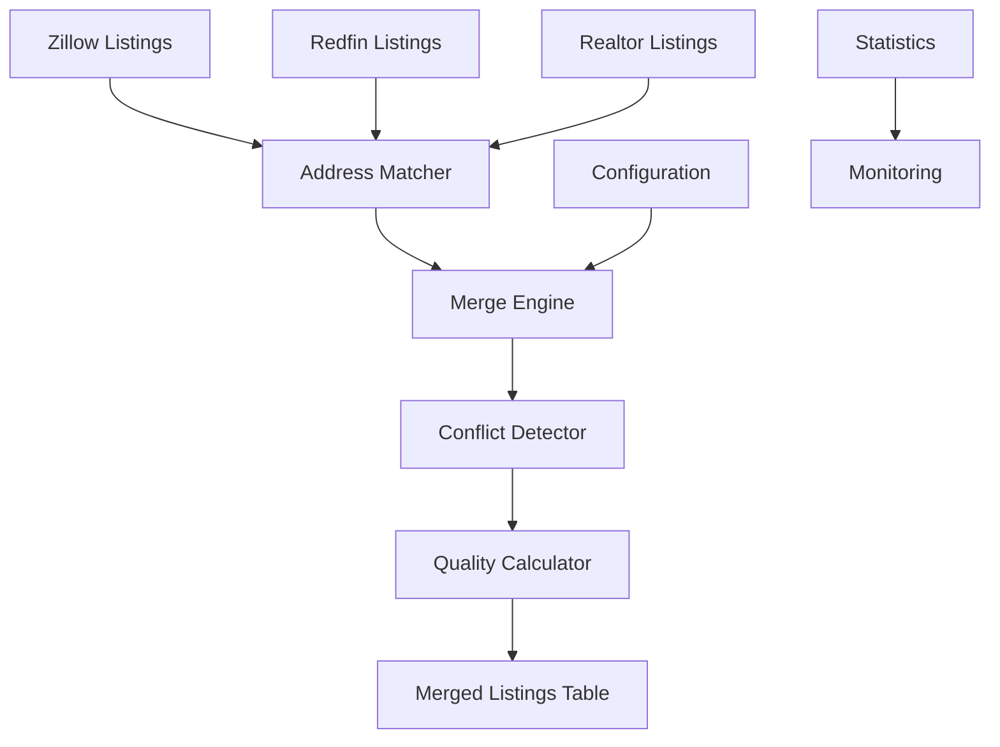

# Merged Listings System Documentation

## Overview

The Merged Listings System is a comprehensive data integration solution that combines property listings from multiple sources (Zillow, Redfin, and Realtor) into a unified dataset. This system provides intelligent matching, conflict detection and resolution, and quality scoring to create the most accurate and complete property information available.

## Table of Contents

1. [Architecture Overview](#architecture-overview)
2. [Database Schema](#database-schema)
3. [Matching Algorithm](#matching-algorithm)
4. [Conflict Detection & Resolution](#conflict-detection--resolution)
5. [Configuration System](#configuration-system)
6. [Usage Guide](#usage-guide)
7. [API Reference](#api-reference)
8. [Troubleshooting](#troubleshooting)
9. [Maintenance](#maintenance)

## Architecture Overview

### System Components



### Key Features

- **Multi-Source Integration**: Combines data from Zillow, Redfin, and Realtor
- **Intelligent Matching**: Uses address normalization, fuzzy matching, and coordinate-based matching
- **Conflict Detection**: Identifies and logs data conflicts with detailed resolution tracking
- **Quality Scoring**: Calculates confidence and quality scores for each merged record
- **Configurable Processing**: Flexible configuration system with environment variable overrides
- **Comprehensive Monitoring**: Detailed statistics and conflict analysis
- **Publication Tracking**: Tracks which listings have been published to users

## Database Schema

### Main Tables

#### `merged_listing`

The primary table storing merged property data.

**Core Identity Fields:**

- `the_real_deal_id` (SERIAL PRIMARY KEY) - Internal unique identifier
- `address` (VARCHAR) - Normalized address used for matching
- `original_addresses` (JSONB) - Original addresses from each source

**Geographic Data:**

- `lat`, `lon` (DECIMAL) - Averaged coordinates
- `zip5`, `city`, `state` - Location information

**Merged Numeric Fields:**

- `price` - Average listing price
- `last_sold_price` - Average last sold price
- `bedrooms`, `bathrooms` - Average room counts
- `sqft` - Average square footage
- `year_built` - Average or most common year built
- `lot_size` - Average lot size

**Source-Specific Text Fields:**

- `zillow_overview` - Text/description from Zillow
- `redfin_overview` - Listing remarks from Redfin
- `realtor_overview` - Text description from Realtor

**Source Tracking:**

- `zillow_id`, `redfin_id`, `realtor_id` - Links to source records
- `source_count` - Number of contributing sources
- `data_sources` (JSONB) - Detailed source information

**Quality & Matching Metadata:**

- `matching_method` - How the record was matched
- `confidence_score` - Matching confidence (0.00-1.00)
- `quality_score` - Overall data quality (0.00-1.00)
- `address_similarity_score` - Address matching score
- `coordinate_distance_meters` - Distance between coordinates

**Conflict Tracking:**

- `data_conflicts` (JSONB) - Detailed conflict information
- `conflict_count` - Number of conflicts detected
- `has_price_conflicts`, `has_size_conflicts` - Quick conflict flags

**Publication & Status:**

- `published` (BOOLEAN) - Whether published to users
- `published_at` - Publication timestamp

**Future Extensions:**

- `ranking_score` - For future ranking algorithms
- `ranking_factors` (JSONB) - Ranking calculation details
- `investment_metrics` (JSONB) - Investment analysis data

#### `merge_config`

Configuration settings for the merge process.

- `config_key` - Configuration parameter name
- `config_value` - Parameter value
- `description` - Human-readable description
- `data_type` - Value type (string, number, boolean, json)

#### `merge_statistics`

Daily statistics and monitoring data.

- `run_date` - Date of merge run
- `total_processed`, `total_merged` - Processing counts
- `exact_matches`, `fuzzy_matches`, `coordinate_matches` - Match type counts
- `conflicts_detected` - Number of conflicts found
- `processing_time_seconds` - Execution time
- `avg_confidence_score`, `avg_quality_score` - Quality metrics

## Matching Algorithm

### Comprehensive Multi-Tier Matching Strategy

The system uses an advanced **comprehensive evaluation approach** that simultaneously evaluates both address AND coordinates for every record, ensuring maximum accuracy and preventing missed matches.

#### Core Principle: Parallel Evaluation

**Every candidate property is scored on BOTH:**

- **Address similarity** (exact, fuzzy, or none)
- **Coordinate proximity** (distance in meters)

**No sequential fallbacks** - all methods are evaluated simultaneously for the best possible match.

#### 1. Address Normalization

```javascript
// Example normalization
"123 Main Street, Apt 4A" → "123 main st unit 4a"
```

**Normalization Rules:**

- Convert to lowercase
- Standardize abbreviations (Street → st, Avenue → ave, etc.)
- Remove punctuation
- Standardize unit notation
- Normalize whitespace

#### 2. Five-Tier Matching System

**Tier 1: Very Close Coordinates (Override Mode)**

- **Distance**: ≤10 meters
- **Behavior**: Automatically matches regardless of address differences
- **Confidence**: 95%
- **Use Case**: Same building with address variations
- **Example**: Properties 1.5m apart with different unit formats

**Tier 2: Close Coordinates + Address Similarity**

- **Distance**: ≤50 meters (configurable)
- **Requirement**: Any address similarity score >0
- **Confidence**: Max of address or coordinate score
- **Combined Score**: (Address × 0.6) + (Coordinate × 0.4)

**Tier 3: Exact Address + Coordinate Validation**

- **Address**: Perfect match after normalization
- **Coordinate Check**: Must be ≤200m or missing coordinates
- **Confidence**: 100% (or 70% if coordinates suspicious)
- **Safety**: Prevents false matches from identical street names

**Tier 4: Fuzzy Address + Reasonable Distance**

- **Address**: ≥80% similarity (configurable)
- **Distance**: ≤200 meters or missing coordinates
- **Confidence**: Address similarity score
- **Use Case**: Minor address variations

**Tier 5: Coordinate-Only Matching**

- **Distance**: ≤50 meters (configurable)
- **Coordinate Score**: ≥80%
- **Requirement**: No good address match available
- **Use Case**: Different address formats, same location

#### 3. Enhanced Coordinate Matching

- **Haversine distance formula** for accurate geographic calculations
- **GPS precision tolerance** accounts for data collection variations
- **Distance-based overrides** for very close properties
- **Validation checks** prevent impossible coordinate combinations

#### 4. Intelligent Address Matching

- **Levenshtein distance algorithm** for fuzzy matching
- **Field-specific mapping** handles different source schemas:
  - Zillow: `address`, `lat`, `lon`
  - Redfin: `address`, `lat`, `lon`
  - Realtor: `street`, `latitude`, `longitude`
- **Configurable thresholds** for different matching strictness levels

#### 5. Comprehensive Evaluation Process

```javascript
// For each target property, evaluate ALL candidates
for (const candidate of allCandidates) {
  // Calculate both scores simultaneously
  const addressScore = calculateAddressSimilarity(target, candidate);
  const distance = calculateDistance(
    target.lat,
    target.lon,
    candidate.lat,
    candidate.lon
  );
  const coordinateScore = 1 - distance / maxDistance;

  // Apply tier-based matching logic
  if (distance <= 10) {
    // Tier 1: Auto-match very close properties
    match = { confidence: 0.95, method: "coordinates_exact" };
  } else if (distance <= 50 && addressScore > 0) {
    // Tier 2: Hybrid matching
    match = {
      confidence: Math.max(addressScore, coordinateScore),
      method: "hybrid",
    };
  }
  // ... additional tier logic
}
```

#### 6. Debug Output Example

```
🔍 Finding matches for: 59 elm ave (41.23386310, -80.49809695)
  ✅ Zillow match: 59 elm ave (method: coordinates_exact, confidence: 0.950, distance: 1.5m)
  ✅ Redfin match: 59 elm avenue (method: hybrid, confidence: 0.920, distance: 2.1m)
  ✅ Realtor match: 59 elm ave (method: coordinates_exact, confidence: 0.950, distance: 1.8m)
  📊 Total matches found: 3/3 sources
```

### Matching Configuration

```javascript
{
  coordinate_tolerance_meters: 50,      // Distance tolerance
  address_fuzzy_threshold: 0.8,        // Similarity threshold
  enable_fuzzy_matching: true,          // Enable fuzzy matching
  min_confidence_score: 0.7,           // Minimum match confidence
  max_coordinate_distance: 100          // Maximum coordinate distance
}
```

## Conflict Detection & Resolution

### Conflict Types

#### 1. Numeric Conflicts

Detected when values differ beyond configurable thresholds:

- **Price conflicts**: >5% difference (configurable)
- **Room count conflicts**: >10% difference
- **Square footage conflicts**: >10% difference
- **Year built conflicts**: >2% difference

#### 2. Text Conflicts

- Different non-empty values for same field
- Stored separately by source (zillow_overview, redfin_overview, etc.)

#### 3. Categorical Conflicts

- Different property types, statuses, etc.
- Resolved using source priority

### Conflict Resolution Strategies

#### Numeric Fields

```javascript
// Average resolution with conflict logging
{
  "price": {
    "values": [
      {"source": "zillow", "value": 250000},
      {"source": "redfin", "value": 255000}
    ],
    "reason": "Price difference > 5%",
    "resolved_value": 252500,
    "resolution_method": "average"
  }
}
```

#### Text Fields

- Source-specific storage (no merging)
- Preserves all information
- Allows manual review

#### Priority-Based Resolution

For categorical fields:

1. **Property Type**: Zillow > Realtor > Redfin
2. **Listing Status**: Zillow > Redfin > Realtor
3. **Address**: Most complete version

## Configuration System

### Configuration Hierarchy

1. **Environment Variables** (highest priority)
2. **Database Configuration**
3. **Default Values** (lowest priority)

### Environment Variables

```bash
# Matching Configuration
MERGE_COORDINATE_TOLERANCE_METERS=50
MERGE_ADDRESS_FUZZY_THRESHOLD=0.8
MERGE_PRICE_CONFLICT_THRESHOLD=0.05
MERGE_ENABLE_FUZZY_MATCHING=true
MERGE_MIN_CONFIDENCE_SCORE=0.7
MERGE_MAX_COORDINATE_DISTANCE=100
MERGE_CONFLICT_DETECTION_ENABLED=true
```

### Database Configuration

Stored in `merge_config` table with validation and type checking.

### Configuration Management

```javascript
// Get configuration
const config = await mergeConfig.getConfigWithOverrides();

// Set configuration
await mergeConfig.setConfig("coordinate_tolerance_meters", 75);

// Initialize defaults
await mergeConfig.initializeConfig();
```

## Usage Guide

### Command Line Interface

#### Basic Usage

```bash
# Merge all listings
npm run merge-listings

# Merge specific zip code
npm run merge-listings -- --zip=16146

# Dry run (preview without changes)
npm run merge-dry-run

# Show statistics
npm run merge-stats

# Show conflict analysis
npm run merge-conflicts

# Initialize configuration
npm run init-merge-config
```

#### Advanced Options

```bash
# Merge with custom zip code
node scripts/merge-listings-task.js --zip=90210

# Show help
node scripts/merge-listings-task.js --help

# Conflict analysis for specific zip
node scripts/merge-listings-task.js --conflicts --zip=16146
```

### Programmatic Usage

```javascript
const mergedListing = require("./models/merged-listing");

// Process all listings
const results = await mergedListing.processAllListings();

// Process specific zip code
const results = await mergedListing.processAllListings("16146");

// Get merged listings with filters
const listings = await mergedListing.getMergedListings({
  zip5: "16146",
  published: false,
  min_quality_score: 0.8,
  source_count: 2,
});

// Update publication status
await mergedListing.updatePublicationStatus([1, 2, 3], true);
```

### Integration with Daily Workflow

The merge process is integrated into the daily GitHub Actions workflow:

```yaml
- name: Merge listing data from all sources
  run: npm run merge-listings

- name: Generate merge statistics report
  run: npm run merge-stats
```

## API Reference

### Core Functions

#### `processAllListings(zipCode)`

Main processing function that merges all listings.

**Parameters:**

- `zipCode` (string, optional) - Filter by zip code

**Returns:**

- `Promise<Object>` - Processing results with statistics

#### `getMergedListings(filters)`

Retrieve merged listings with optional filtering.

**Parameters:**

- `filters` (Object) - Filter options
  - `zip5` (string) - Filter by zip code
  - `published` (boolean) - Filter by publication status
  - `min_quality_score` (number) - Minimum quality score
  - `min_confidence_score` (number) - Minimum confidence score
  - `source_count` (number) - Minimum number of sources
  - `has_conflicts` (boolean) - Filter by conflict presence
  - `limit` (number) - Maximum results

**Returns:**

- `Promise<Array>` - Array of merged listings

#### `updatePublicationStatus(listingIds, published)`

Update publication status for multiple listings.

**Parameters:**

- `listingIds` (Array) - Array of the_real_deal_id values
- `published` (boolean) - Publication status

**Returns:**

- `Promise<number>` - Number of updated records

#### `getConflictSummary(zipCode)`

Get conflict analysis for listings.

**Parameters:**

- `zipCode` (string, optional) - Filter by zip code

**Returns:**

- `Promise<Object>` - Conflict analysis summary

### Address Matching Functions

#### `normalizeAddress(address)`

Normalize address for consistent matching.

#### `calculateAddressSimilarity(address1, address2)`

Calculate similarity score between addresses.

#### `calculateDistance(lat1, lon1, lat2, lon2)`

Calculate distance between coordinates in meters.

#### `findBestMatch(targetProperty, candidates, config)`

Find best matching property from candidates.

### Configuration Functions

#### `getConfigWithOverrides()`

Get configuration with environment variable overrides.

#### `setConfig(key, value, description)`

Set configuration value.

#### `validateConfig(config)`

Validate configuration values.

## Troubleshooting

### Common Issues

#### 1. Low Match Rates

**Symptoms:** High number of unmatched listings

**Possible Causes:**

- Address format differences
- Missing coordinates
- Strict matching thresholds

**Solutions:**

```bash
# Check current configuration
npm run merge-dry-run

# Adjust fuzzy matching threshold
export MERGE_ADDRESS_FUZZY_THRESHOLD=0.7

# Increase coordinate tolerance
export MERGE_COORDINATE_TOLERANCE_METERS=100

# Run conflict analysis
npm run merge-conflicts
```

#### 2. High Conflict Rates

**Symptoms:** Many data conflicts detected

**Possible Causes:**

- Different data collection methods
- Timing differences
- Source-specific formatting

**Solutions:**

```bash
# Analyze conflict patterns
npm run merge-conflicts

# Adjust conflict thresholds
export MERGE_PRICE_CONFLICT_THRESHOLD=0.10

# Review specific conflicts in database
```

#### 3. Performance Issues

**Symptoms:** Long processing times

**Possible Causes:**

- Large dataset size
- Complex matching algorithms
- Database performance

**Solutions:**

- Process by zip code: `npm run merge-listings -- --zip=16146`
- Optimize database indexes
- Consider batch processing

#### 4. Configuration Issues

**Symptoms:** Unexpected behavior, validation errors

**Solutions:**

```bash
# Reset to defaults
npm run init-merge-config

# Validate current config
node -e "
const config = require('./utils/merge-config');
config.getConfigWithOverrides().then(c => {
  const validation = config.validateConfig(c);
  console.log(validation);
});
"
```

### Debugging Tools

#### 1. Dry Run Mode

```bash
npm run merge-dry-run
```

Shows what would be processed without making changes.

#### 2. Statistics Analysis

```bash
npm run merge-stats
```

Shows recent processing statistics and trends.

#### 3. Conflict Analysis

```bash
npm run merge-conflicts
```

Detailed breakdown of conflicts by type and frequency.

#### 4. Database Queries

```sql
-- Check merge quality distribution
SELECT
  quality_score,
  COUNT(*) as count
FROM merged_listing
GROUP BY quality_score
ORDER BY quality_score;

-- Analyze conflict patterns
SELECT
  jsonb_object_keys(data_conflicts) as conflict_field,
  COUNT(*) as frequency
FROM merged_listing
WHERE conflict_count > 0
GROUP BY conflict_field
ORDER BY frequency DESC;

-- Check matching methods
SELECT
  matching_method,
  COUNT(*) as count,
  AVG(confidence_score) as avg_confidence
FROM merged_listing
GROUP BY matching_method;
```

## Maintenance

### Regular Tasks

#### 1. Monitor Processing Statistics

```bash
# Check daily statistics
npm run merge-stats

# Monitor for trends in match rates and conflicts
```

#### 2. Review Configuration

```bash
# Validate configuration monthly
npm run merge-dry-run

# Adjust thresholds based on data quality trends
```

#### 3. Database Maintenance

```sql
-- Update statistics
ANALYZE merged_listing;

-- Check index usage
SELECT schemaname, tablename, indexname, idx_scan
FROM pg_stat_user_indexes
WHERE schemaname = 'public' AND tablename = 'merged_listing';

-- Clean old statistics (keep 90 days)
DELETE FROM merge_statistics
WHERE run_date < CURRENT_DATE - INTERVAL '90 days';
```

#### 4. Quality Assurance

```bash
# Regular conflict analysis
npm run merge-conflicts

# Sample data validation
# Review high-conflict listings manually
```

### Performance Optimization

#### 1. Database Indexes

Ensure proper indexes exist for common queries:

```sql
-- Core indexes (already created)
CREATE INDEX IF NOT EXISTS idx_merged_listing_zip5 ON merged_listing(zip5);
CREATE INDEX IF NOT EXISTS idx_merged_listing_quality ON merged_listing(quality_score);
CREATE INDEX IF NOT EXISTS idx_merged_listing_published ON merged_listing(published);

-- Custom indexes for specific use cases
CREATE INDEX IF NOT EXISTS idx_merged_listing_high_quality
ON merged_listing(zip5, quality_score DESC)
WHERE quality_score >= 0.8;
```

#### 2. Configuration Tuning

Based on data patterns, adjust:

- Fuzzy matching thresholds
- Coordinate tolerance
- Conflict detection sensitivity

#### 3. Processing Optimization

- Consider parallel processing for large datasets
- Implement incremental updates for changed records only
- Use database-level optimizations for bulk operations

### Backup and Recovery

#### 1. Configuration Backup

```bash
# Export configuration
node -e "
const config = require('./utils/merge-config');
config.getAllConfig().then(c => console.log(JSON.stringify(c, null, 2)));
" > merge-config-backup.json
```

#### 2. Data Backup

```sql
-- Backup merged listings
COPY merged_listing TO '/path/to/backup/merged_listing.csv' CSV HEADER;

-- Backup statistics
COPY merge_statistics TO '/path/to/backup/merge_statistics.csv' CSV HEADER;
```

#### 3. Recovery Procedures

```bash
# Restore configuration
npm run init-merge-config

# Re-run merge process
npm run merge-listings

# Validate results
npm run merge-stats
```

### Monitoring and Alerting

#### Key Metrics to Monitor

1. **Match Rate**: Percentage of successfully merged listings
2. **Conflict Rate**: Percentage of listings with conflicts
3. **Processing Time**: Time to complete merge process
4. **Quality Score Distribution**: Average and distribution of quality scores
5. **Error Rate**: Number of processing errors

#### Recommended Alerts

- Match rate drops below 70%
- Processing time exceeds 30 minutes
- Error rate exceeds 5%
- Conflict rate exceeds 50%

### Recent Enhancements (v1.1.0)

#### Critical Matching Algorithm Improvements

**Problem Solved**: Properties with virtually identical coordinates (1.5 meters apart) were not being matched due to sequential fallback logic that failed to properly evaluate coordinate proximity.

**Solution Implemented**:

- **Comprehensive parallel evaluation** - Every record is now checked against every other record using BOTH address AND coordinates simultaneously
- **Multi-tier matching system** with distance-based overrides
- **Tier 1 matching** automatically matches properties ≤10 meters apart regardless of address differences
- **Enhanced debugging** with detailed console output showing match decisions

**Expected Results**:

- Properties 1.5m apart will now achieve 95% confidence matches
- Significant increase in 3-source matches (Zillow + Redfin + Realtor)
- Better utilization of coordinate data for matching decisions
- Improved overall match rates and data quality

**Verification Commands**:

```bash
# Test the enhanced matching
npm run merge-listings -- --zip=16146

# Check for 3-source matches
SELECT source_count, COUNT(*) FROM merged_listing GROUP BY source_count;

# Verify coordinate-based matches
SELECT matching_method, COUNT(*) FROM merged_listing GROUP BY matching_method;
```

### Future Enhancements

#### Planned Features

1. **Machine Learning Integration**: Use ML for better matching and conflict resolution
2. **Real-time Processing**: Process updates as they arrive
3. **Advanced Ranking**: Implement investment attractiveness scoring
4. **API Endpoints**: REST API for external access
5. **Dashboard**: Web interface for monitoring and management

#### Extension Points

- Custom matching algorithms
- Additional data sources
- Custom conflict resolution strategies
- Advanced quality metrics
- Integration with external systems

---

## Support

For questions or issues with the Merged Listings System:

1. Check this documentation
2. Review troubleshooting section
3. Analyze logs and statistics
4. Check configuration settings
5. Contact the development team

**Last Updated:** December 2024
**Version:** 1.0.0
